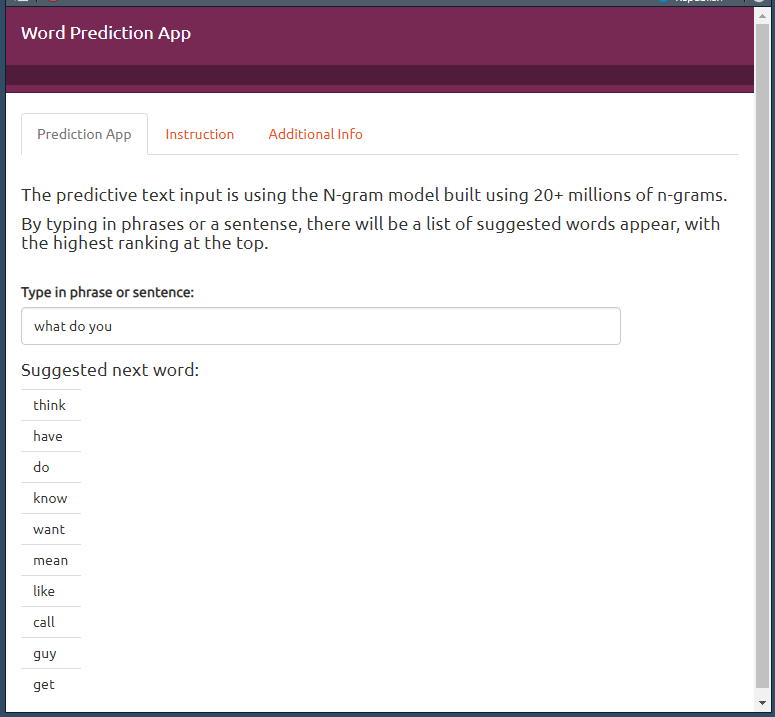

```{r setup, include=FALSE}
knitr::opts_chunk$set(echo = FALSE)
```

## Overview

The Coursera Data Science Specialization Capstone project from Johns Hopkins University (JHU), partnered with SwiftKey (http://swiftkey.com/en/), is to deploy an interactive R Shiny application that predicts the next word based on a given input.

The objective of this project is to build a Shiny app that takes as input a phrase (multiple words) in a text box input and outputs a prediction of the next word based on a predictive text model. The data used in the model came from a corpus called HC Corpora (www.corpora.heliohost.org). 

## Approach

- Data Processing:

    Three types of data including twitter, news and blogs were consumed to train the model. Appropriate data cleaning and sub-setting techniques were applied to finalize the training data. 
    
- Algorithm for word prediction:

    Various word combinations (N-Grams) were created using clean data sets (tokenizing) and a predictive algorithm (Stupid Back-off ) was applied to predict next word. 

- Optimization:

    The final predictive model was optimized appropriately to work as a Shiny application.
    

    Github Repository: (https://github.com/liuliuc/DataScienceCapstone)

## Data processing and Prediction Algorithm

- Convert to lower case
- Remove profanity words, hyperlinks, repeats, punctation and non-ASCII characters and white space
(The profanity words list were downloaded from: https://github.com/LDNOOBW/List-of-Dirty-Naughty-Obscene-and-Otherwise-Bad-Words))
- This app used N-gram natural language modeling method for the next word prediction. Based on the fact how many words were used to build a n-gram, they are called uni-, bi (2), tri(3), four(4) ….. n-gram. For the project Uni-, Bi-, Tri-, Four- and Five-gram models were built using quanteda.
- In each N-gram, the frequency of occurence of each word was counted, and the probability (prob) was calculated for a single occurence of word. Those serve as the training dataset. 
- For the application a stupid back-off model is used to determine which N-gram model to use. Given an input string, the prediction model uses the last 3 words entered to search the four-gram model. If no match was found, it backs off to the last 2 words and uses the tri-gram model.  If there is still no match the most likely unigram estimates will be choosen.

## N-gram tokenization

This table summarizes N-grams information and the four-gram wordcloud is shown as an example. 

```{r cars, echo = FALSE, warning=FALSE}
(if (!require("wordcloud2", quietly = TRUE) ) install.packages("wordcloud2"))
library(wordcloud2)
setwd("C:/Users/LLIU01/Desktop/Temp/Coursera/DataScienceCapstoneProject/DSCapstoneShiny")
load("nrows2.RData")
load("max.freq2.RData")
knitr::kable(data.frame(Ngram=c("uni.freq","bi.freq","tri.freq","four.freq","five.freq"),nRows=paste0(nrows2), MaxFreqency=paste0(max.freq2)))
load("fourwc2.RData")
fourwc2
```

## The Shiny App

- The goal of this project was to create a product to use the prediction algorithm built and to provide an interface for easy testing.
- The Shiny app is available here: https://liuliwest.shinyapps.io/DSCapstoneShiny
- It is simple and intuitive to use. Just type in the first few words of a sentence and the suggested next word will show up at the bottom, as shown below.

    
- Future enhancements: add more features to the shiny UI.
Github Repository: (https://github.com/liuliuc/DataScienceCapstone)

